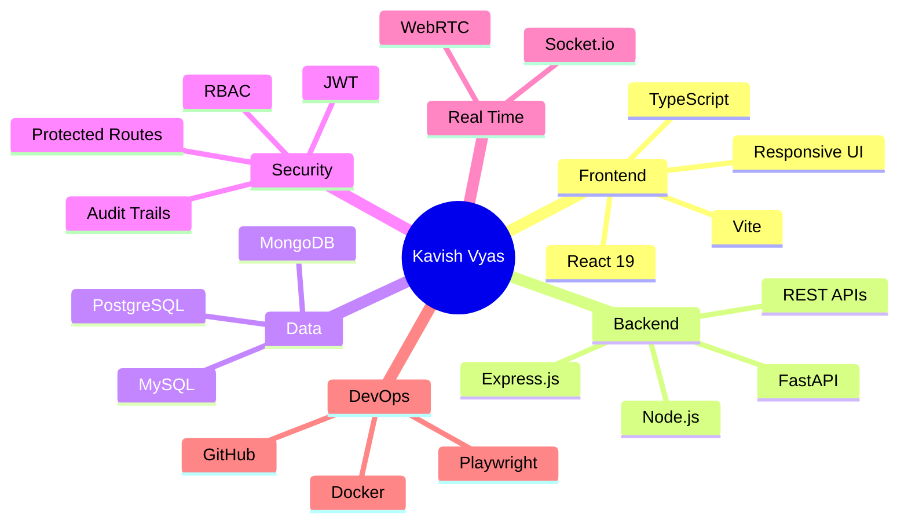
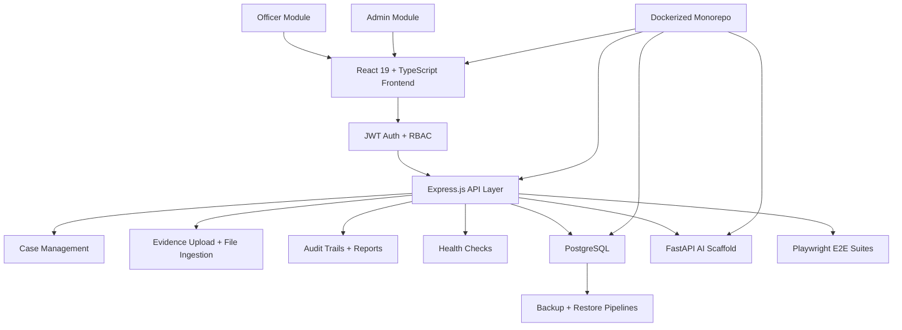
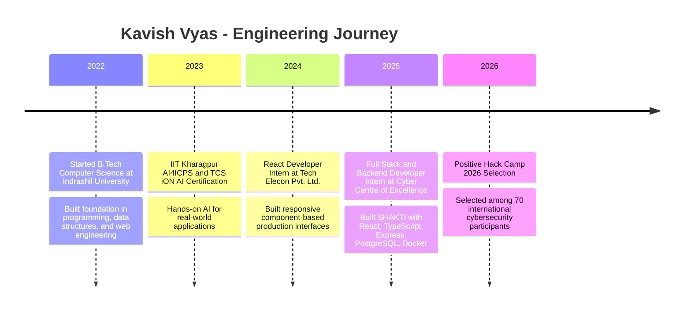

 <div align="center">


[](https://git.io/typing-svg)

[](https://github.com/Kavish0001)
[](https://linkedin.com/in/kavish-kashyapbhai-vyas)
[](mailto:kavishvyas17@gmail.com)
[](#)

<br />


</div>

---

## About Me

```yaml
name: Kavish Kashyapbhai Vyas
location: Ahmedabad, Gujarat, India
role: Full Stack Developer
education: B.Tech Computer Science, Indrashil University
cgpa: 8.5 / 10.0
focus:
  - MERN applications
  - secure REST APIs
  - role-based access control
  - real-time systems
  - cybersecurity platforms
contact: kavishvyas17@gmail.com
github: https://github.com/Kavish0001
linkedin: https://linkedin.com/in/kavish-kashyapbhai-vyas
```

I am a Computer Science undergraduate and full stack developer who builds production-grade web platforms, REST APIs, real-time systems, and security-oriented tools. My strongest work so far is SHAKTI, an investigation-support and telecom-analysis platform deployed for 50-100 officers at the Cyber Centre of Excellence, Government of Gujarat.

---

## Current Focus

| Area | What I am doing |
|:---|:---|
| Building | SHAKTI-style secure platforms with React, TypeScript, Node.js, Express, PostgreSQL, and Docker |
| Exploring | Cybersecurity workflows, automation, evidence handling, audit trails, and AI-assisted investigation tools |
| Learning | Deeper backend architecture, deployment pipelines, testing, and scalable API design |
| Open to | Full stack, backend, MERN, cybersecurity-oriented engineering, and real-time collaboration projects |
| Ask me about | React, Node.js, Express, PostgreSQL, MongoDB, JWT, RBAC, WebRTC, Socket.io, Docker |

---

## How I Build

> Ship features that people can actually use.

> Keep security close to the architecture, not as a patch after release.

> Build APIs that are predictable, testable, and easy for future engineers to understand.

---

## Tech Toolbox

<div align="center">


</div>



---

## Featured Projects

<div align="center">

<table>
<tr>
<td width="50%" valign="top">

### SHAKTI

**Investigation-support and telecom-analysis platform**


- Deployed for 50-100 officers at a state cyber cell
- 200+ REST API endpoints for investigation workflows
- Evidence upload, file ingestion, case management, audit trails
- JWT authentication, officer/admin RBAC, and protected routes
- Dockerized monorepo with backup/restore and Playwright E2E suites

</td>
<td width="50%" valign="top">

### Meet Aura

**Real-time video conferencing platform**


- Browser-based video conferencing app
- Peer-to-peer media communication with WebRTC
- Socket.io signaling server and room management
- Audio/video stream handling for multi-participant calls

</td>
</tr>
<tr>
<td width="50%" valign="top">

### PaperVault

**Academic paper repository platform**


- Uploading, categorizing, and retrieving past exam papers
- Backend routes for metadata management and structured retrieval
- Full-stack workflow with React, Express, and MongoDB

</td>
<td width="50%" valign="top">

### Security Automation

**Reusable engineering practices from real deployments**


- RBAC-first API design
- Protected routes and audit reporting
- Health checks, backups, and restore scripts
- Test coverage for user-facing workflows

</td>
</tr>
</table>

</div>

---

## SHAKTI Architecture



---

## Development Journey



---

## GitHub Profile

<div align="center">


</div>

---

## Development Breakdown

```txt
JavaScript / TypeScript   ████████████████████░░░░░   MERN apps, APIs, dashboards
React + Vite              ██████████████████░░░░░░░   component-based interfaces
Node.js + Express         ███████████████████░░░░░░   REST APIs, auth, RBAC
PostgreSQL + MongoDB      ████████████████░░░░░░░░░   schemas, queries, document data
Python + FastAPI          ████████████░░░░░░░░░░░░░   AI scaffolds and service APIs
Docker + Testing          █████████████░░░░░░░░░░░░   deployment, E2E, repeatability
Security Engineering      ███████████████░░░░░░░░░░   JWT, protected routes, audit trails
```

---

## GitHub Metrics Setup

The live `metrics.lecoq.io` image can fail or show broken alt text on GitHub, so I removed it from the visible README. For the best lowlighter/metrics setup, add this workflow in your profile repository as `.github/workflows/metrics.yml`, then embed the generated `github-metrics.svg`.

```yaml
name: Metrics

on:
  schedule:
    - cron: "0 0 * * *"
  workflow_dispatch:

jobs:
  github-metrics:
    runs-on: ubuntu-latest
    steps:
      - uses: lowlighter/metrics@latest
        with:
          token: ${{ secrets.METRICS_TOKEN }}
          user: Kavish0001
          template: classic
          base: header, activity, community, repositories, metadata
          plugin_isocalendar: yes
          plugin_languages: yes
          plugin_languages_limit: 8
          plugin_languages_sections: most-used
          filename: github-metrics.svg
```

After the workflow creates the SVG, add this to the README:

```md

```

---

## Experience

<details open>
<summary><b>Full Stack and Backend Developer Intern - Cyber Centre of Excellence, CID Crime Gujarat Police</b></summary>

<br />

**Aug 2025 - Apr 2026**

- Architected and delivered SHAKTI, a production-grade platform used by 50-100 law-enforcement officers for cybercrime and telecom-analysis workflows.
- Engineered 200+ REST API endpoints for case management, evidence upload, file ingestion, health checks, audit trails, and protected officer/admin operations.
- Designed a Dockerized monorepo deployment with frontend, backend, PostgreSQL, FastAPI AI scaffold, orchestration scripts, backup/restore pipelines, and Playwright E2E suites.
- Built JWT authentication and RBAC to separate officer/admin modules and protect API surfaces.
- Received an Appreciation Letter from Shri Vivek Bheda, IPS, Superintendent of Police, Cyber Centre of Excellence.

</details>

<details>
<summary><b>React Developer Intern - Tech Elecon Pvt. Ltd.</b></summary>

<br />

**Jun 2024 - Jul 2024**

- Built responsive, component-based frontend interfaces with React.js, JavaScript, HTML5, and CSS3.
- Created reusable React components to improve modularity, maintainability, and development consistency.

</details>

---

## Achievements

- **Positive Hack Camp 2026:** selected by Positive Technologies and the Russian Ministry of Digital Development, Moscow, among 70 international participants.
- **Appreciation Letter:** recognized by Cyber Centre of Excellence, Gujarat State, for contributions to SHAKTI.
- **IIT Kharagpur AI Certification:** Hands-on Approach to AI for Real-World Applications, AI4ICPS I Hub Foundation and TCS iON.
- **Hackathon Finalist:** final-round participant in Odoo Hackathon and Indus Hackathon.

---

## Connect

<div align="center">

I am open to full stack engineering, backend development, MERN projects, cybersecurity-oriented platforms, and real-time collaboration systems.

<br />
<br />

[](https://linkedin.com/in/kavish-kashyapbhai-vyas)
[](mailto:kavishvyas17@gmail.com)

<br />
<br />


</div>
