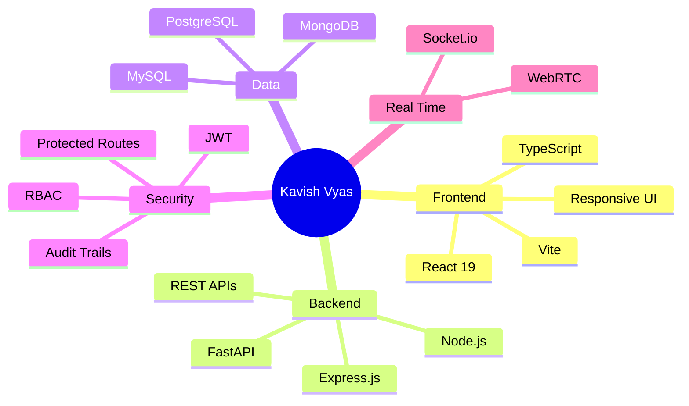
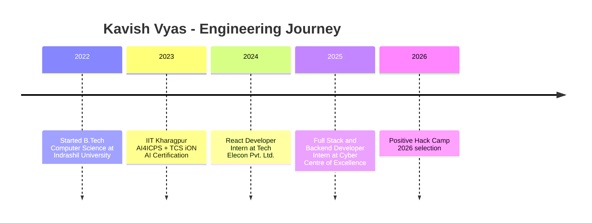

 <div align="center">


[](https://git.io/typing-svg)

[](https://github.com/Kavish0001)
[](https://linkedin.com/in/kavish-kashyapbhai-vyas)
[](mailto:kavishvyas17@gmail.com)
[](#)

</div>

---

## Snapshot

```txt
Role       Full Stack Developer + Security-Aware Engineer
Stack      React 19, TypeScript, Node.js, Express, PostgreSQL, MongoDB, Python
Focus      MERN apps, REST APIs, RBAC, real-time systems, secure engineering
Current    B.Tech Computer Science, Indrashil University, CGPA 8.5/10
Highlight  SHAKTI platform deployed for 50-100 law-enforcement officers
```

<table>
  <tr>
    <td width="55%">
      <h3>What I do</h3>
      <p>
        I am a Computer Science undergraduate and full stack developer who builds production-grade web platforms, REST APIs,
        real-time systems, and security-oriented tools. I enjoy turning complex operational workflows into clean software that
        is fast to use, reliable to deploy, and easier to maintain.
      </p>
      <ul>
        <li>Built <b>SHAKTI</b>, an investigation-support and telecom-analysis platform used at the Cyber Centre of Excellence, Government of Gujarat.</li>
        <li>Engineered <b>200+ REST API endpoints</b> across case workflows, evidence handling, audit trails, health checks, and admin/officer modules.</li>
        <li>Selected for <b>Positive Hack Camp 2026</b> in Moscow among 70 international cybersecurity participants.</li>
      </ul>
    </td>
    <td width="45%">
      
      <br />
      
    </td>
  </tr>
</table>

## Tech Toolbox

<div align="center">


</div>



## Featured Work

<table>
  <tr>
    <td width="50%">
      <h3>SHAKTI</h3>
      <p><b>Investigation-Support and Telecom Analysis Platform</b></p>
      <p>
        Production-grade Dockerized monorepo deployed for cybercrime and law-enforcement workflows at a state government cyber cell.
      </p>
      <p>
        <code>React 19</code> <code>TypeScript</code> <code>Node.js</code> <code>Express</code> <code>PostgreSQL</code> <code>Docker</code> <code>FastAPI</code> <code>JWT</code> <code>Playwright</code>
      </p>
    </td>
    <td width="50%">
      <h3>Meet Aura</h3>
      <p><b>Real-Time Video Conferencing Platform</b></p>
      <p>
        Browser-based video conferencing app with WebRTC peer media communication, Socket.io signaling, room management, and audio/video stream handling.
      </p>
      <p>
        <code>React</code> <code>Node.js</code> <code>WebRTC</code> <code>Socket.io</code>
      </p>
    </td>
  </tr>
  <tr>
    <td width="50%">
      <h3>PaperVault</h3>
      <p><b>Academic Paper Repository Platform</b></p>
      <p>
        Full-stack platform for uploading, categorizing, and retrieving past exam papers with structured backend routes and metadata workflows.
      </p>
      <p>
        <code>React</code> <code>Node.js</code> <code>Express</code> <code>MongoDB</code>
      </p>
    </td>
    <td width="50%">
      <h3>Security + Automation</h3>
      <p><b>Engineering habits from real deployments</b></p>
      <p>
        RBAC-first API design, protected routes, audit reporting, health checks, backup/restore scripts, and Playwright E2E coverage.
      </p>
      <p>
        <code>RBAC</code> <code>Docker</code> <code>Testing</code> <code>Monitoring</code>
      </p>
    </td>
  </tr>
</table>

## Career Timeline



## GitHub Activity

<div align="center">


</div>

## Metrics

<div align="center">


</div>

> The metrics card uses [lowlighter/metrics](https://github.com/lowlighter/metrics), an embeddable GitHub profile metrics generator with many plugin options. For the most powerful setup, generate this SVG with a GitHub Action and commit the output into your profile repository.

## Experience

<details open>
<summary><b>Full Stack and Backend Developer Intern - Cyber Centre of Excellence, CID Crime Gujarat Police</b></summary>

<br />

**Aug 2025 - Apr 2026**

- Architected and delivered SHAKTI, a production-grade platform used by 50-100 law-enforcement officers for cybercrime and telecom-analysis workflows.
- Engineered 200+ REST API endpoints for case management, evidence upload, file ingestion, health checks, audit trails, and protected officer/admin operations.
- Designed a Dockerized monorepo deployment with frontend, backend, PostgreSQL, FastAPI AI scaffold, orchestration scripts, backup/restore pipelines, and Playwright E2E suites.
- Built JWT authentication and RBAC to separate officer/admin modules and protect API surfaces.
- Received an Appreciation Letter from Shri Vivek Bheda, IPS, Superintendent of Police, Cyber Centre of Excellence.

</details>

<details>
<summary><b>React Developer Intern - Tech Elecon Pvt. Ltd.</b></summary>

<br />

**Jun 2024 - Jul 2024**

- Built responsive, component-based frontend interfaces with React.js, JavaScript, HTML5, and CSS3.
- Created reusable React components to improve modularity, maintainability, and development consistency.

</details>

## Achievements

- **Positive Hack Camp 2026:** selected by Positive Technologies and the Russian Ministry of Digital Development, Moscow, among 70 international participants.
- **Appreciation Letter:** recognized by Cyber Centre of Excellence, Gujarat State, for contributions to SHAKTI.
- **IIT Kharagpur AI Certification:** Hands-on Approach to AI for Real-World Applications, AI4ICPS I Hub Foundation and TCS iON.
- **Hackathon Finalist:** final-round participant in Odoo Hackathon and Indus Hackathon.

## Let's Build

<div align="center">

I am open to full stack engineering, backend development, MERN projects, cybersecurity-oriented platforms, and real-time collaboration systems.

<br />
<br />

[](https://linkedin.com/in/kavish-kashyapbhai-vyas)
[](mailto:kavishvyas17@gmail.com)


</div>
